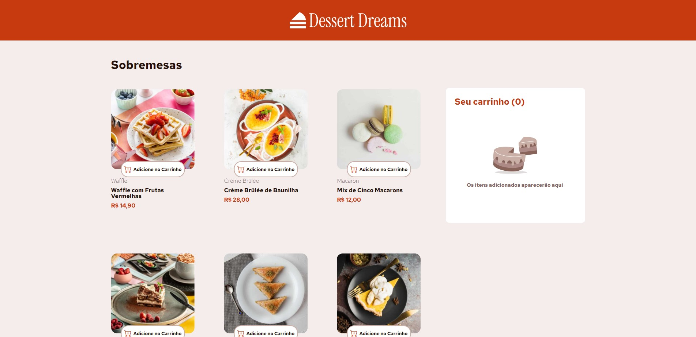

# Dessert Dreams

**Dessert Dreams** é um site fictício criado para demonstrar habilidades de desenvolvimento em React, Styled-Components e Context API. O site exibe uma seleção de sobremesas e permite que os usuários adicionem itens ao carrinho de compras e finalizem o pedido.

## Tecnologias Utilizadas

- **React**: Biblioteca para construção de interfaces de usuário.
- **Styled-Components**: Biblioteca para estilização de componentes.
- **Bootstrap**: Framework CSS para estilização responsiva.
- **React-Scroll**: Biblioteca para navegação suave.
- **Context API**: Gerenciamento de estado global para o carrinho de compras.

## Funcionalidades

- **Visualização de Produtos**: Exibe uma lista de sobremesas com imagens, descrições e preços.
- **Carrinho de Compras**: Permite adicionar, remover e ajustar a quantidade de itens no carrinho.
- **Finalização de Pedido**: Simula a confirmação de um pedido com um modal de carregamento.

## Link para o Site

Você pode visualizar o projeto [aqui](https://dessert-dreams-tbr4.vercel.app/).